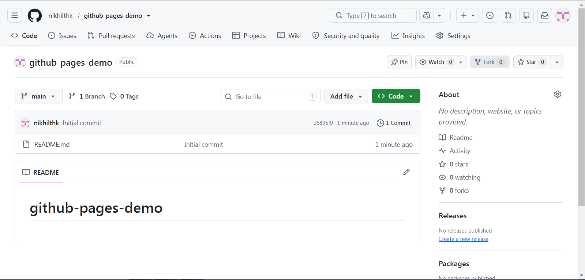
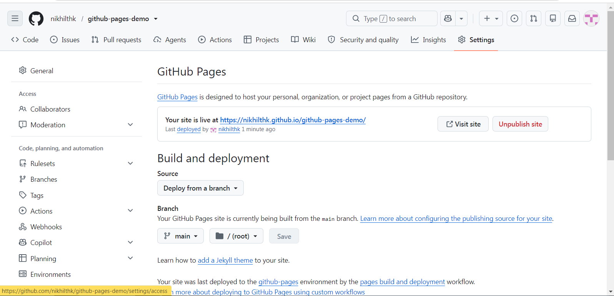
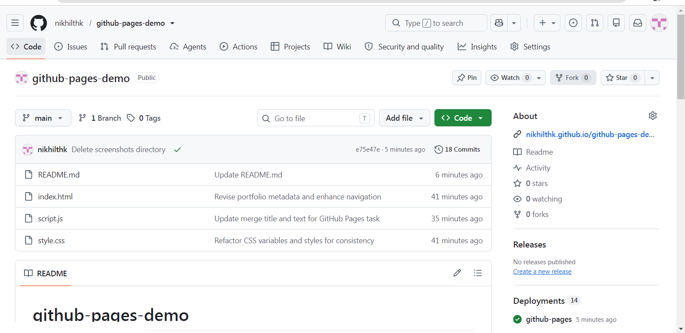

# github-pages-demo

Task 5: Host a static website with GitHub Pages.

## Live website
https://nikhilthk.github.io/github-pages-demo/

## What I did
1. Created a public GitHub repository
2. Created `index.html`, `style.css` and `script.js`
3. Enabled GitHub Pages from the `main` branch and root folder
4. Opened the live site from the link GitHub provided
5. Added the live link to the repo's About section
6. Customised the page with CSS and JavaScript (theme toggle, deploy simulator, checklist)

## Features
- Dark and light theme toggle that remembers your choice
- Typing animation in the hero section
- Interactive deploy pipeline simulator
- Checklist with a progress bar

## Screenshots

